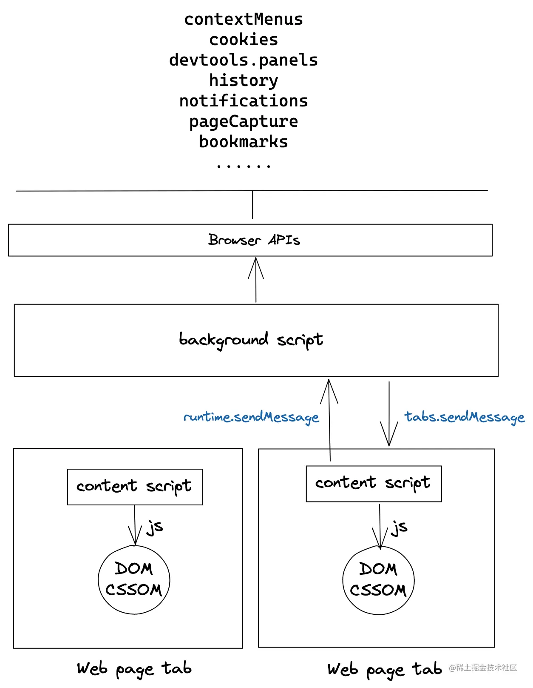
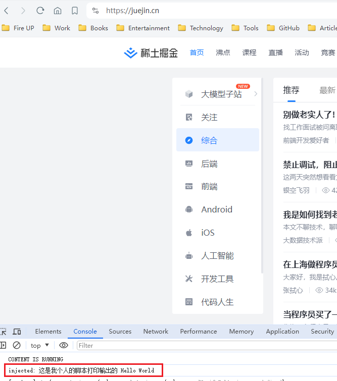
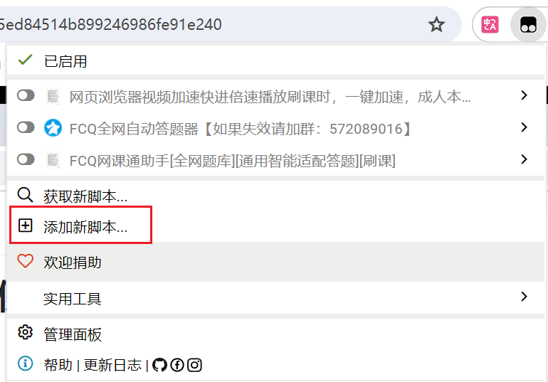
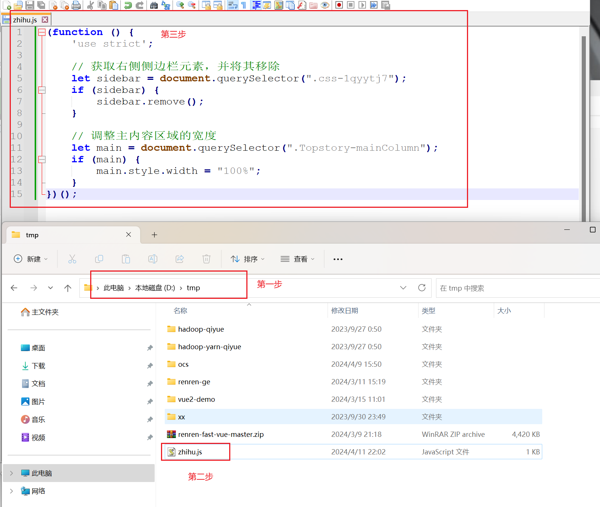
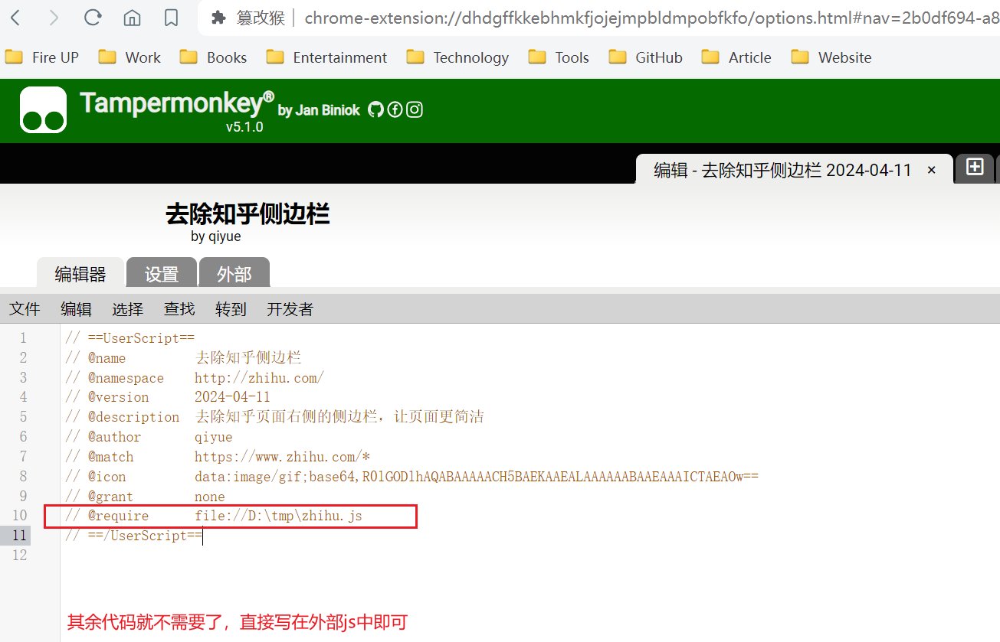
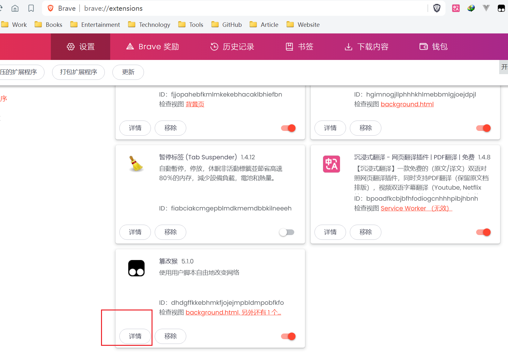
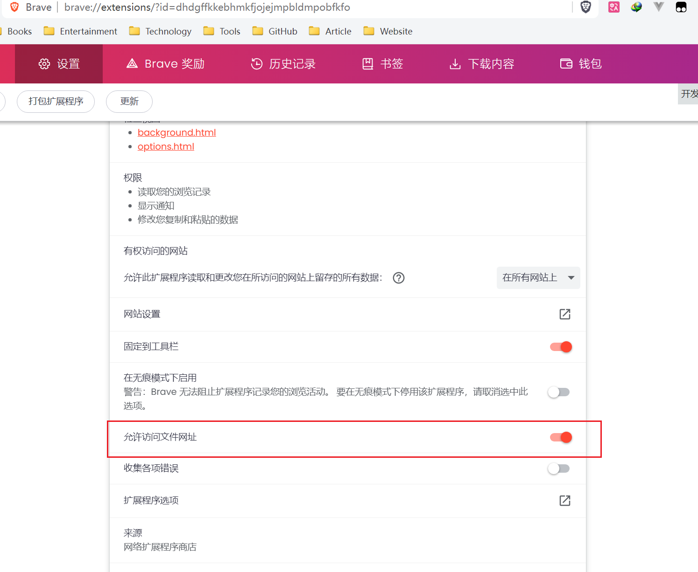

# tampermokey-script-dev
tampermokey 油猴脚本开发

# 浏览器插件(Browser Extension)

浏览器插件也叫浏览器的扩展应用。

浏览器插件主要由四部分构成：`background scripts`、`content scripts`、`全局UI元素` 和 `option page`。

* background scripts：后台脚本，一个后台脚本就是一个独立的线程，是游离于各个页面之外的“上帝之眼”；具有访问各类插件API的能力，但同时也丧失了直接操作页面的能力。
* content scripts：内容脚本，具有直接操作页面的能力；其实就是在页面中运行JS脚本，可以使用DOM API；content scripts 只能直接访问少量插件API，但能和 background scripts 进行双向通信完成数据交换。
* 全局UI元素：浏览器层的UI交互，包括：

1. 在Toolbar显示icon，定义点击icon后显示的Popup或其它效果
2. 增加邮件选项
3. 增加全局快捷键
4. 改造新Tab页、历史记录页、书签页

* option page：插件配置页



以上这些API中经常使用的列举如下：

* `contextMenus`：增加右键选项

1. 使用选中文本，例如：划词翻译、文本收集
2. 快速调用插件功能，例如：打开DevTool、页面裁剪

* `cookies`：增删改查cookie（任意域名），直接拿着本地cookie发送请求，不必再做授权。同时由于后台脚本不是Web页面，在发送请求时没有跨域限制：

1. 多平台信息聚合
2. 多平台信息分发

* `devtools.panels`：增加DevTool面板，比如Vue.js devtools
* `notifications`：浏览器通知，未打开页面的情况下进行通知，可以辅助一些工具类应用
* `storage`：全局保存数据，可跟随浏览器账户同步

更多API可以查阅：

[Chrome Extension API Reference](https://developer.chrome.com/docs/extensions/reference?hl=zh-cn)

[Microsoft Edge 扩展支持的 API](https://learn.microsoft.com/zh-cn/microsoft-edge/extensions-chromium/developer-guide/api-support)

[Mozilla WebExtensions API](https://developer.mozilla.org/zh-CN/docs/Mozilla/Add-ons/WebExtensions/API)

# 油猴插件(Tampermonkey)

浏览器插件可以实现各式各样的功能，但有时候开发者只是想对某一个站点增加一点小功能，如果这也要构建环境打包上架分发，未免太麻烦了些。

油猴插件为轻量化脚本提供了一个平台，在线编辑器中编写油猴脚本即时生效，通过GitHub、GreasyFork快速分发。

在油猴插件中，`content script`起到非常重要的作用，它将用户编写的代码运行在页面中，同时提供 `GM_xxxx` 函数封装浏览器的部分能力。封装的内部实现是和 `background script` 通信，驱动 `background script`调用插件API。

对油猴插件有了简单了解后，来看看如何编写一个油猴脚本吧~~~。


## Tampermonkey API

油猴脚本由头部和核心逻辑两部分组成

```javascript
// ==UserScript==
// @name         New Userscript
// @namespace    http://tampermonkey.net/
// @version      0.1
// @description  try to take over the world!
// @author       You
// @match        https://www.tampermonkey.net/documentation.php?ext=dhdg
// @icon         https://www.google.com/s2/favicons?domain=tampermonkey.net
// @grant        none
// ==/UserScript==

(function() {
    'use strict';

    // Your code here...
})();
```

头部是脚本的一些元信息、更新方式、指定运行页面、权限声明，逐一解释一下：

| 配置名       | 作用                                                 | 使用技巧                                                     |
| ------------ | ---------------------------------------------------- | ------------------------------------------------------------ |
| @name        | 脚本的显示名称                                       | 加后缀实现国际化，例如：@name:zh-CN 指定在浏览器语言为中文时显示的名称 |
| @namespace   | 脚本的命名空间，可以理解为脚本的标识                 | 为了避免冲突一般用github仓库地址                             |
| @version     | 与更新相关，当前版本                                 |                                                              |
| @updateURL   | 检查脚本是否更新地址                                 | 配合@version和自动更新使用                                   |
| @downloadURL | 检测到更新时，去哪下载脚本                           |                                                              |
| @supportURL  | 遇到问题时，用户去哪反馈                             |                                                              |
| @include     | 脚本在哪些页面运行                                   | 可以使用正则，不支持 hashtag，多个页面的地址声明多个 @include 即可 |
| @match       | 与 @include 类似                                     |                                                              |
| @exclude     | 脚本禁止在哪些页面运行，优先于@include               |                                                              |
| @require     | 在脚本运行前引入**外部 JavaScript 文件**             | 例如，引入 jQuery                                            |
| @resource    | 声明**外部资源文件**，搭配 `GM_getResourceText` 使用 | 例如，引入 html、icon                                        |
| @connect     | 声明 `GM_xmlhttpRequest` 可访问的域                  | 必须指定才能正常请求                                         |
| @grant       | 声明 `GM_xxx` 函数的使用列表                         | 必须先指定权限才能正常使用                                   |
| @run-at      | 指定脚本运行时机                                     | document-start: 尽快执行 <br/>document-body: 当 body 挂载时执行<br/> document-end: DOMContentLoaded 触发时执行<br/> document-idle: DOMContentLoaded 触发后执行，也是默认设置项<br/> context-menu: 右键菜单项被点击时执行 |
| @author      | 作者名                                               |                                                              |
| @description | 简短介绍                                             | 同样可以加后缀实现国际化                                     |
| @homepage    | 主页地址                                             | 如果未设置并且 @namespace 是仓库地址，默认导向仓库地址       |
| @icon        | 脚本icon                                             |                                                              |
| @icon64      | 64*64像素的脚本icon                                  |                                                              |
| @antifeature | 脚本是否有广告、挖矿、数据收集等商业行为             |                                                              |
| @noframes    | 声明脚本不在 iframe 中运行                           |                                                              |

核心逻辑通过一个立即执行函数包裹，避免和全局作用域相互干扰。Tampermonkey 将浏览器的部分能力封装为 `GM_XXX` 函数以供调用。

| API                                                          | 作用                                                         | 使用技巧                                           |
| ------------------------------------------------------------ | ------------------------------------------------------------ | -------------------------------------------------- |
| unsafeWindow                                                 | 访问页面的 Window 对象                                       |                                                    |
| GM_addStyle(css)                                             | 创建全局样式的快捷方式，向页面插入 style 元素                | 也可以用 DOM 操作手动创建                          |
| GM_addElement(tag_name, attributes) GM_addElement(parent_node, tag_name, attributes) | 向 DOM 新建元素的快捷方式                                    | 也可以用 DOM 操作手动创建                          |
| GM_log(message)                                              | 在 console 中打印信息                                        | console.log 的快捷方式                             |
| GM_setValue(name, value)                                     | 持续化存储数据                                               |                                                    |
| GM_getValue(name, defaultValue)                              | 从存储体中获取数据                                           |                                                    |
| GM_deleteValue(name)                                         | 从存储体中删除数据                                           |                                                    |
| GM_listValues()                                              | 列举存储体中所有数据项                                       |                                                    |
| GM_addValueChangeListener                                    | 监听数据更新                                                 | 例如要使 Tab 间数据同步，可以用监听 value 达成同步 |
| GM_removeValueChangeListener                                 | 移除监听                                                     |                                                    |
| GM_getResourceText(name)                                     | 获取 @resource 中已声明的资源                                |                                                    |
| GM_getResourceURL(name)                                      | 获取 @resource 中已声明的资源（base64 URI 形式）             |                                                    |
| GM_registerMenuCommand(name, fn, accessKey)                  | 在 Tampermonkey 的 popup 中增加选项                          |                                                    |
| GM_unregisterMenuCommand(menuCmdId)                          | 移除选项                                                     |                                                    |
| GM_openInTab(url, options)                                   | 新开一个 tab 页                                              |                                                    |
| GM_xmlhttpRequest(details)                                   | 使用后台脚本进行请求，自动带上 cookie，无跨域问题，目标域需要在 @connect 中提前声明 |                                                    |
| GM_download(details)                                         | 下载资源到本地                                               |                                                    |
| GM_getTab(callback)                                          | 获取当前 tab 的 object 对象                                  |                                                    |
| GM_saveTab(tab)                                              | 通过 tab 的 object 对象重新打开一个 tab                      |                                                    |
| GM_getTabs(callback)                                         | 获取当前存活的所有 tab 的对象，以便和其他脚本实例偶同学      |                                                    |
| GM_notification                                              | 使用插件 notification API 弹出桌面通知                       |                                                    |
| GM_setClipboard                                              | 复制内容到剪贴板                                             |                                                    |
| GM_info                                                      | 获取脚本的油猴插件的信息                                     |                                                    |

完整的说明文档：[Tampermonkey documentation](https://www.tampermonkey.net/documentation.php)

## 实践：打印 Hello, World

> 做一个非常简单的小练习：创建一个名为“Hello”的脚本，当进入掘金和知乎页面时，在Console中打印“Hello, World”。

1、新建脚本

2、修改脚本名称

3、指定运行地址 `@match` 或 `@include`

4、直接使用 `console.log` 或者声明权限调用 `GM_log`

```javascript
// ==UserScript==
// @name         Hello
// @namespace    http://tampermonkey.net/hello
// @version      0.1
// @description  try to take over the world!
// @author       You Name
// @match        https://zhihu.com/*
// @match        https://juejin.cn/*
// @grant        GM_log
// ==/UserScript==

(function() {
    'use strict';
    GM_log("这是我个人的脚本打印输出的 Hello World");
})();
```

执行效果如下：




# 案例

## 案例1：去除知乎侧边栏

### 1.1 功能描述

> 删除知乎页面右侧的信息边栏，同时将主内容区域的宽度增加，增加大主要内容的显示范围。

### 1.2 新建脚本

点击Tampermonkey图标，选择“添加新脚本”按钮：



```js
// ==UserScript==
// @name         去除知乎侧边栏
// @namespace    http://zhihu.com/
// @version      2024-04-11
// @description  去除知乎页面右侧的侧边栏，让页面更简洁
// @author       qiyue
// @match        https://www.zhihu.com/*
// @icon         data:image/gif;base64,R0lGODlhAQABAAAAACH5BAEKAAEALAAAAAABAAEAAAICTAEAOw==
// @grant        none
// ==/UserScript==

(function () {
    'use strict';

    // 获取右侧侧边栏元素，并将其移除
    let sidebar = document.querySelector(".css-1qyytj7");
    if (sidebar) {
        sidebar.remove();
    }

    // 调整主内容区域的宽度
    let main = document.querySelector(".Topstory-mainColumn");
    if (main) {
        main.style.width = "100%";
    }
})();
```

### 1.3 引用外部js文件

> 除了上述直接将代码写在油猴脚本中的方式外，其实我们还可以使用将js代码写到我们的本地任意目录中，然后在油猴脚本中再引用我们这个外部js脚本的方式。

#### 1.3.1 编写外部js文件



#### 1.3.2 引用外部js文件

当在外部写好js文件后，接下来我们只需要通过如下方式在油猴脚本中直接通过 `@require` 引用外部js文件即可：



#### 1.3.3 开启油猴访问文件URL的权限

> 油猴可以通过 `// @require      file://‪D:\tmp\zhihu.js` 的方式引用外部js文件，如果要引用本地文件，则需要在浏览器插件设置中开启允许油猴访问文件URL设置。





这种方式我看网上资料大部分都是可以的，但是在我本地测试是不行的，一直报错：`@require: couldn't load @require from forbidden URL 'file://‪d:\tmp\zhihu.js'`。算了，记录一下有这种方式吧，感觉意义不大，还是直接将js写在脚本中好些吧。


[本文参考自【轻松上手】油猴脚本开发](https://juejin.cn/post/7022654292880424991)
[更多内容](https://learn.scriptcat.org/%E7%AE%80%E4%BB%8B/)
